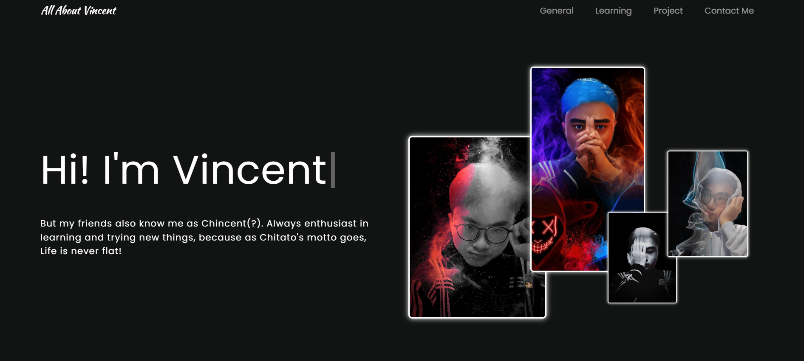
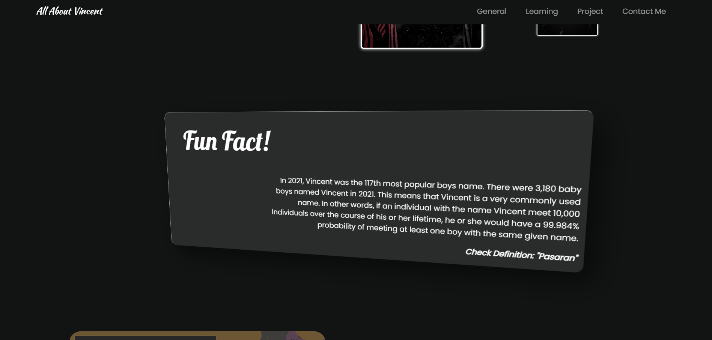
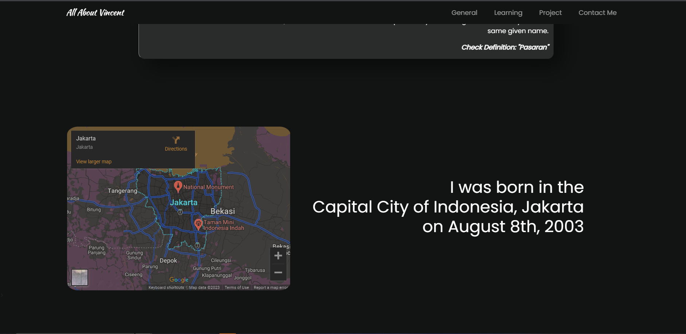
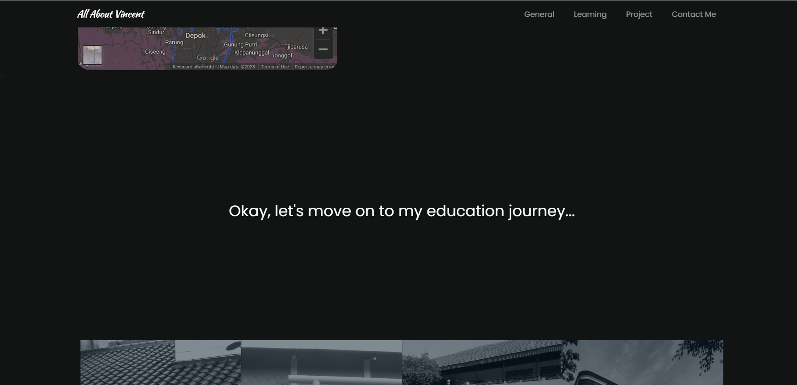
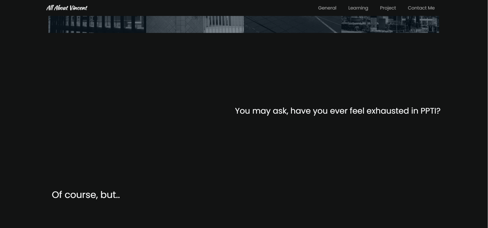
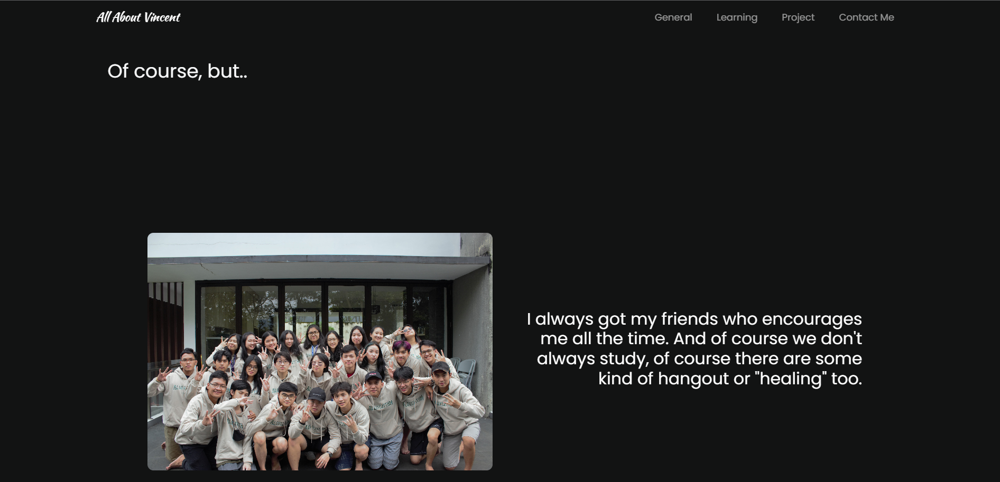
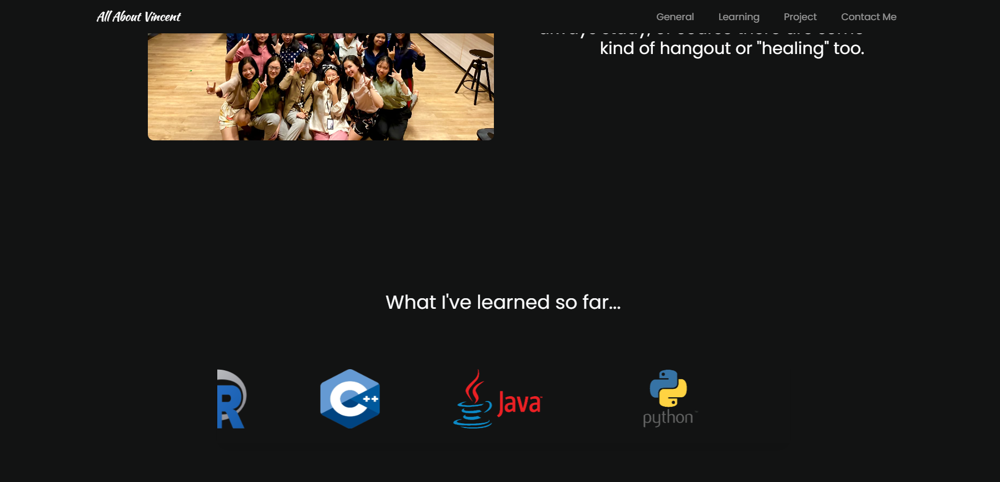
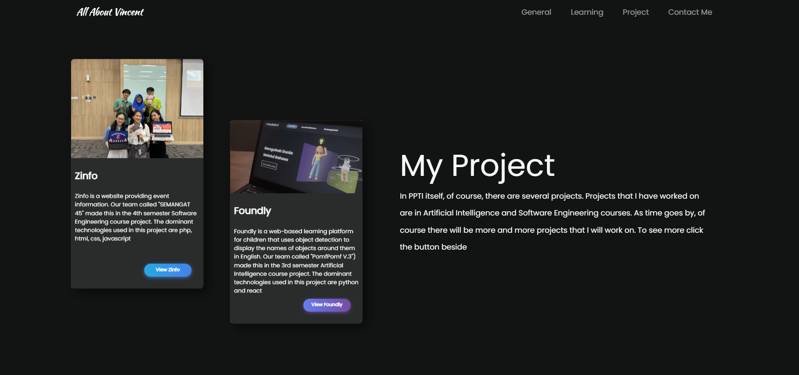
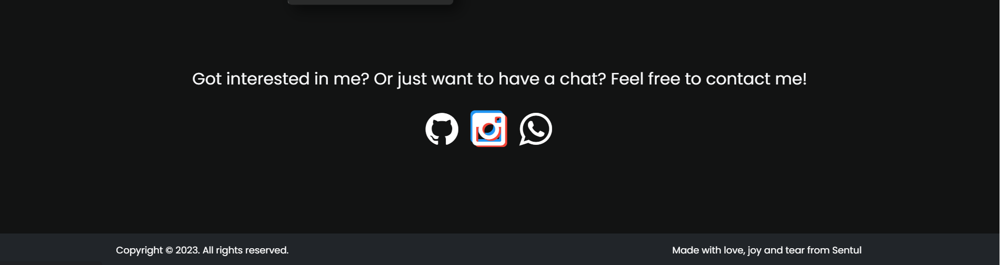

# All About Vincent (A Web Development Project)

This is a profile website project for Web Development Course from PPTI BCA. I'm Vincent Kartamulya Santoso and in this website you will see my little story with an experience. For me, the point of this website is to tell story to all of you and how my intent and message can be delivered to all of you in a not boring but simple design. 

## 🛠 Technology Used
- Laravel
- CSS Framework: Bootstrap (installed on pc using vite and npm)
- HTML
- CSS
- Javascript

## ⚡️ Section
- General
- Learning
- Project
- Contact Me

## 1. General Section

This is the initial display when the user visits this website. There will be a navbar that refers to a certain section, as well as an animation in the form of typing. This page contains brief information about the name.

Scroll down and you will find funfacts about the name Vincent. In this section there is also an animation where when the cursor approaches this section, there is a tilting animation according to the movement and position of the cursor.

In this section, there is information about Vincent's place and date of birth. What's also interesting here is the embeded google maps where Vincent was born, so you can scroll and explore the place where he was born

## 2. Learning Section

Before entering the learning section, there is sentence who greets you first, because the concept of this website is to read like a comic or book and have fun, not an ordinary website so it is hoped that a 2-way connection can occur.

This is the core of the learning section where you can see Vincent's educational history from elementary school to the present. There is also an animation here, when you place the cursor on a section, then information on the name of the school and information about it will appear at a glance.

Then, we will meet again with the conversation, where Vincent tells about his life at PPTI. As before, the purpose of this website is to tell stories.

In this section, Vincent tells a sneak peak of his life in PPTI. There is a carousel of images of his friends.

You will see skills that Vincent have learn in the form of automatic slider.

## 3. Project Section

This section gives you information about any projects Vincent has worked on. In addition, also in each project, there is a button, where you can see immediately both the results and the project's source code. Making this view is assisted by Bootstrap.

## 4. Contact Me Section

Finally, if you want to have a chat with me or just grab a coffee together, you can contact me in this section. There are instagram, whatsapp and github. If you click one of the icon, there will be like disco animation. And below that there is a footer. 

## Authors

- [@vincent-kartamulya](https://github.com/vincent-kartamulya/)
